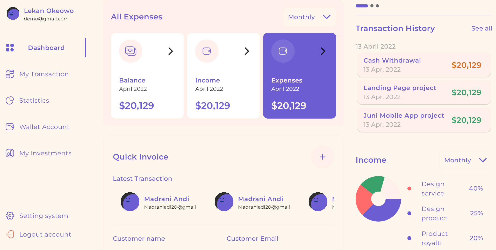
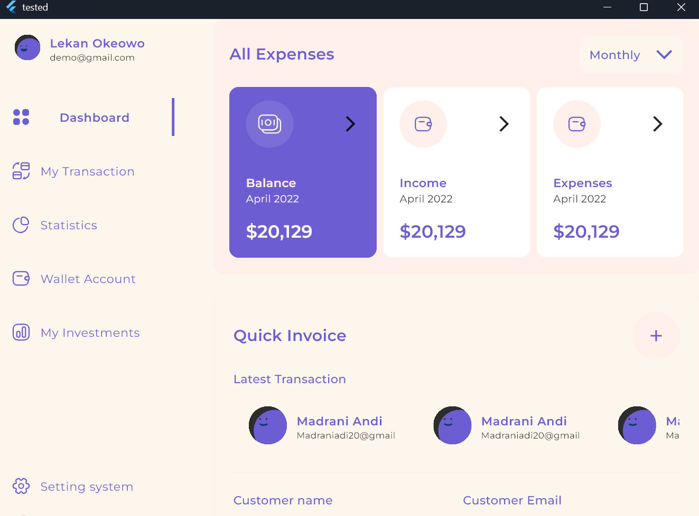
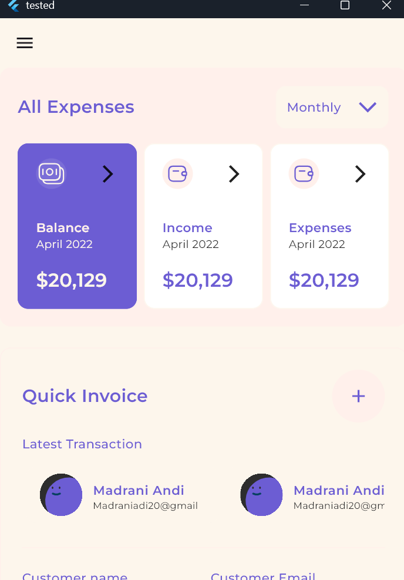

# 📊 Flutter Web Dashboard

تطبيق Dashboard مبني باستخدام Flutter، ومصمم خصيصًا لأجهزة Mobile,Taplet,Desktop. يتميز بواجهة مستخدم ديناميكية وتكامل .

## 🚀 الخصائص الرئيسية

- واجهة مستخدم تفاعلية ومتجاوبة (Responsive UI)
- يدعم شاشات التابلت والكمبيوتر وموبايل
- تصميم يعمل علي جميع الاحجام
- تجربة مستخدم سلسة وأداء عالي

## 💻 التقنيات والحزم المستخدمة

- ✅ Flutter Web
- ✅ Custom Widgets
- ✅ Svg
- ✅ device_preview
- ✅ expandable_page_view

## 📸 لقطات شاشة

### 🧭 تصميم الكمبيوتر

  
  

### 🧭 تصميم التابلت

  

### 🧭 تصميم الموبايل

  
  

## 📥 تنزيل التطبيق

لتحميل نسخة APK الخاصة بالتطبيق:  
📥 [Download APK](build/app/outputs/flutter-apk/app-release.apk)     

## 📲 تنزيل النسخة التجريبية

يمكنك تنزيل وتثبيت النسخة الحالية من التطبيق من خلال الضغط على الزر أدناه:

